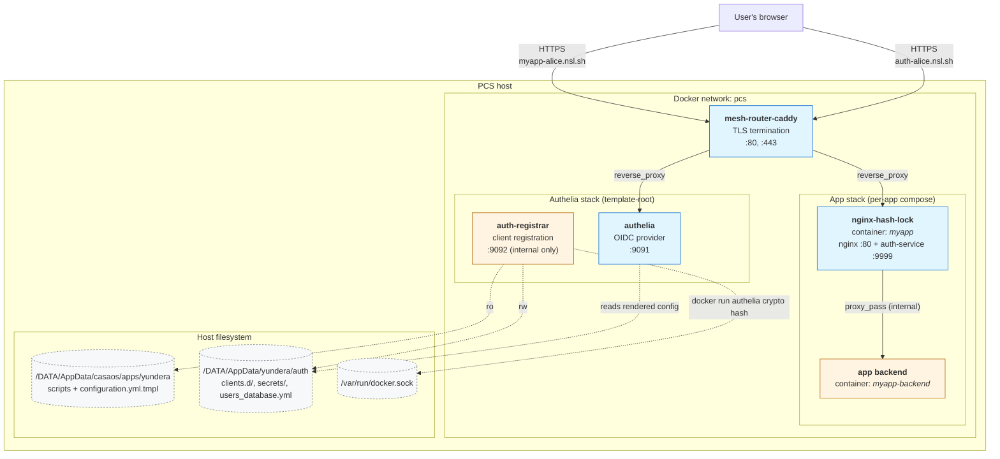
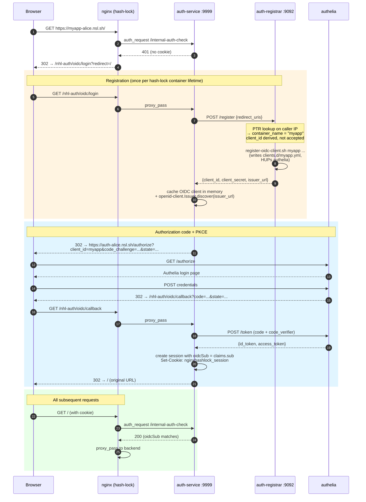

# Architecture: Nginx Hash Lock + Yundera Authelia OIDC

This document describes how `nginx-hash-lock` integrates with Yundera's Authelia instance to provide zero-config OIDC authentication for apps installed on a PCS. It covers the static container layout, the data flow for a first-time user hit, and the trust boundaries the design relies on.

## Components

| Component | Repo | Role | Network exposure |
|---|---|---|---|
| **mesh-router-caddy** | mesh-router-root | Edge TLS termination, subdomain → container routing via labels | Public (`:80`, `:443`) |
| **authelia** | — (upstream image `authelia/authelia:4.39`) | OIDC provider, user login, session management | Public via `auth-${DOMAIN}` (Caddy-routed) |
| **auth-registrar** | mesh-router-root/mesh-router-auth | Auto-registers OIDC clients for apps; derives `client_id` from caller's container name via PTR | **Internal only** (`pcs` network, `:9092`) |
| **nginx-hash-lock** (this repo) | Nginx-hash-lock | Per-app authentication sidecar. Terminates OIDC flow, manages session cookies, proxies to the real backend | Public via `<app>-<user>.${DOMAIN}` (Caddy-routed) |
| **app backend** | *(each app)* | The actual service being protected (ttyd, Jellyfin, etc.) | Internal (reached only via hash-lock) |

All of the above share the Docker `pcs` network. The app's backend container should have a name different from the hash-lock sidecar — the mesh-router routes `<container_name>-<user>.${DOMAIN}` to the container literally named `<container_name>`, so the sidecar must claim that name for subdomain routing to work.

## Static architecture

**Key point:** `auth-registrar` is the only service that touches both the host Docker socket and `authelia`'s config files — it's a concentrated-trust component. Every other hash-lock sidecar stays unprivileged.

## Data flow: first user hit on a protected path

This is the only non-trivial flow. Subsequent requests in the same session are a straight `auth_request → 200 → proxy_pass` with no round-trips to Authelia or the registrar.

### What's cached where

| State | Location | Lifetime |
|---|---|---|
| OIDC client (`{client_id, client_secret}`) | `clients.d/myapp.yml` + `clients.d/myapp.secret` on host | Persists across restarts. Idempotent re-registration returns the same secret. |
| OIDC client instance (`openid-client.Client`) | `auth-service` in-memory | Cleared on container restart. First login after restart triggers re-registration (no-op on the script side, just a fetch round-trip). |
| Session cookie | `auth-service` in-memory `sessions` dict | Cleared on container restart. Browser gets a fresh redirect-to-login on next request. |
| Authelia session | Authelia-side cookie on `auth-${DOMAIN}` | Independent of app sessions. Drives Authelia SSO — re-entering an OIDC flow from a second app within the Authelia session inactivity window skips the login prompt. |

## Trust boundaries

1. **Public edge** — Caddy handles TLS and routes by subdomain. Anything inside `pcs` trusts that `X-Forwarded-Host` came from Caddy; if Caddy is ever bypassed, the redirect URI validation downstream becomes the only defense.
2. **pcs network, public services** — Authelia and every hash-lock sidecar. Mutually reachable. An app-level RCE can reach them, so they assume hostile peers on the network (hence the PTR-based attestation on the registrar rather than "trust any caller on pcs").
3. **pcs network, private services** — `auth-registrar` and app backends. Not Caddy-labelled; not reachable from outside pcs. Backends are additionally firewalled behind their hash-lock sidecar at the routing layer (Caddy only labels the sidecar's container name, not the backend's).
4. **Host** — the `auth-registrar` container mounts the Docker socket and `/DATA/AppData/yundera/auth`. This is the concentrated-risk surface: one audited container can invoke `docker run` and write Authelia's config. Everything else stays unprivileged.

Redirect URI validation is the second line of defense if attestation is ever wrong: the registrar requires the first DNS label of every `redirect_uri` to equal the attested `client_id` or start with `client_id-`. See [mesh-router-auth/src/validation.ts](../../yundera-root/packages/mesh-router-root/mesh-router-auth/src/validation.ts) — the tests cover the typosquat cases (`myapp2.*` rejected).

## Integration checklist for a new app

To opt an app into OIDC auth:

1. Compose the app with a hash-lock sidecar whose `container_name` matches the app name (mesh-router routing constraint).
2. Attach the sidecar to the external `pcs` network so it can reach `auth-registrar`.
3. Set `OIDC_REGISTRAR_URL: "http://auth-registrar:9092"` on the sidecar. That single env var enables OIDC — no other secrets to inject, the sidecar self-registers.

See the "OIDC via Yundera Authelia" example in [../README.md](../README.md) for a complete compose snippet.

## Known limitations

- **OIDC mode currently supersedes** hash and credentials modes. Mixing (e.g. "hash-param for dashboard quick-access, OIDC for real users") is on the roadmap but not implemented.
- **Redirect URI updates** are not handled by the underlying `register-oidc-client.sh` script — an app that changes its canonical hostname requires manual cleanup of `clients.d/<id>.{yml,secret}` before the next registration. Tracked for a `--force` patch in template-root.
- **Session persistence** is in-memory. A restart of the hash-lock container logs everyone out of that app; Authelia's own session is unaffected, so re-login is transparent as long as the Authelia session is still valid.
- **Container name is the OIDC client id**, which means re-deploying an app under a different container name creates an orphan OIDC client entry. De-registration on uninstall is a nice-to-have not yet wired up.
